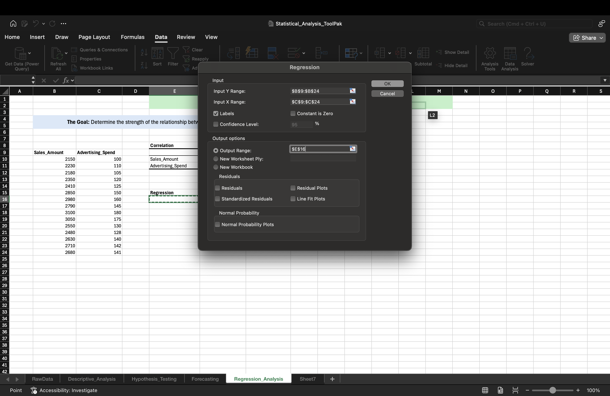

Excel Project: Statistical Analysis with the Analysis ToolPak

**Project Status:** Completed

## Project Objective

This project's objective was to use Excel's robust **Analysis ToolPak** to perform a thorough statistical analysis of a sales and marketing dataset.  In order to address deeper, more intricate business questions regarding data distribution, the impact of marketing strategies, sales trends, and the predictive power of advertising spend, this project goes beyond simple reporting.

 The ability to use a variety of statistical techniques to derive useful, data-driven insights is demonstrated in this portfolio item.
---

## Skills and Tools Demonstrated

This project showcases proficiency in the core statistical functions of the Excel Analysis ToolPak:

*   **Descriptive Statistics:** Generated a full statistical summary (Mean, Median, Standard Deviation, etc.) to get a quick and thorough understanding of the dataset.
  
*   **Data Visualization:** Created a **Histogram** to visualize the frequency distribution of sales data.
   
*   **Hypothesis Testing:**
    *   **ANOVA:** Performed an Analysis of Variance to test if there was a statistically significant difference between the performance of three different marketing campaigns.
      
    *   **t-Test:** Conducted a t-Test to perform a direct, head-to-head comparison between two specific campaigns.
      .png)
    *   **F-Test:** Used an F-Test to compare the variance (consistency) of sales results between two campaigns.
      
*   **Time-Series Forecasting:**
    *   **Moving Average:** Calculated a moving average to smooth out daily fluctuations and identify the underlying sales trend.
      
    *   **Exponential Smoothing:** Applied exponential smoothing as an alternative forecasting method that gives more weight to recent data.
       
*   **Predictive Modeling:**
    *   **Correlation:** Calculated the correlation coefficient to measure the strength and direction of the linear relationship between advertising spend and sales.
       
    *   **Linear Regression:** Built a simple linear regression model to predict future sales based on advertising spend, and evaluated the model's strength using key metrics like **R-Square** and **Significance F**.
       

---

## Key Questions Answered in This Analysis

This project was structured to answer four key business questions, with each part using a different set of statistical tools.

### Part A: What is the overall performance of our sales?
*   **Tools Used:** Descriptive Statistics, Histogram.
*   **Insight:** The analysis provided an instant summary of our sales data, showing an average daily sale of approximately $2,609, with sales ranging from a minimum of $2,150 to a maximum of $3,100.

### Part B: Are our marketing campaigns actually different from each other?
*   **Tools Used:** ANOVA, t-Test, F-Test.
*   **Insight:** The ANOVA test confirmed with high statistical confidence (P-value < 0.05) that there was a significant difference in sales performance between the campaigns. A subsequent t-Test confirmed that Campaign B performed significantly better than Campaign A.

### Part C: What is the underlying trend in our daily sales?
*   **Tools Used:** Moving Average, Exponential Smoothing.
*   **Insight:** Both forecasting methods successfully smoothed the volatile daily sales data, revealing a clear upward trend during the middle of the period that began to level off. This provides a clearer picture of business momentum than looking at raw daily sales.

### Part D: Can we use advertising spend to predict future sales?
*   **Tools Used:** Correlation, Regression.
*   **Insight:** The analysis revealed an extremely strong positive correlation (~0.99) between ad spend and sales. The regression model was highly significant, with an **R-Square value of 97.7%**. This means that 97.7% of the change in sales can be explained by advertising spend, giving us a powerful and reliable formula to forecast future revenue based on planned marketing budgets.

---

## How to Use This Workbook

1.  Open the `Statistical_Analysis_ToolPak.xlsx` file. Ensure the Analysis ToolPak is enabled (**Data -> Data Analysis**).
2.  The **`RawData`** sheet contains the original dataset.
3.  Each subsequent sheet (`Descriptive_Analysis`, `Hypothesis_Testing`, `Forecasting`, `Regression_Analysis`) contains the output and results for each part of the project, demonstrating a different set of tools.
