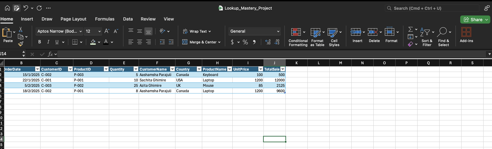
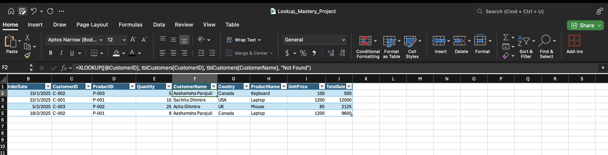
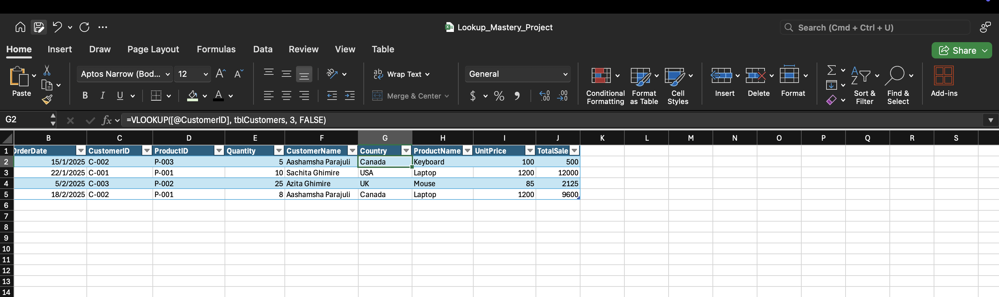
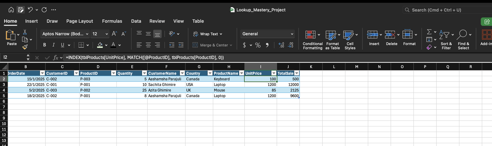

# Excel Project: Mastering Lookup Functions for Data Merging

**Project Status:** Completed | **Scope:** Minor Project

## Project Objective

The objective of this project was to demonstrate mastery of Excel's most critical lookup functions (`XLOOKUP`, `VLOOKUP`, and `INDEX/MATCH`) to solve a common and essential business problem: merging data from multiple, separate sources into a single, comprehensive master report.

This project showcases the core data analyst skill of **data enrichment**—taking a basic set of transactional data and enriching it with related information from lookup tables to enable meaningful analysis.

---

## Skills and Tools Demonstrated

This project is a focused demonstration of the functions that form the backbone of data manipulation in Excel:

*   **Data Structuring:** Utilized **Excel Tables** with clear naming conventions (`tblOrders`, `tblCustomers`, `tblProducts`) to create robust, scalable, and readable data sources.

*   **Data Merging & Enrichment:**
    *   **`XLOOKUP` (Modern Standard):** Used the newest and most flexible lookup function to pull in `CustomerName` and `ProductName`. This demonstrates proficiency with current Excel best practices.
      
    *   **`VLOOKUP` (Classic Method):** Used the traditional `VLOOKUP` function to retrieve `Country` data, proving an understanding of legacy methods and their specific syntax (e.g., column index numbers, exact match flag).
      
    *   **`INDEX/MATCH` (Advanced/Flexible Method):** Used the powerful `INDEX/MATCH` combination to look up `UnitPrice`. This demonstrates a deeper, more advanced knowledge of Excel's lookup capabilities, prized for its flexibility and performance.
      

*   **Calculations with Structured References:** Performed final calculations (`TotalSale`) using modern, readable **structured references** (e.g., `=[@Quantity]*[@UnitPrice]`), which is a feature of Excel Tables.

---

## Key Project Steps

1.  **Data Setup:** Three separate datasets—Orders, Customers, and Products—were established in their own sheets and converted into named Excel Tables.
2.  **Master Report Creation:** A new table was created by copying the base `tblOrders` data. New, empty columns were added to hold the enriched data.
3.  **Data Merging:** Each of the three lookup methods was used to pull specific fields from the `tblCustomers` and `tblProducts` tables into the `Master_Report` table, using the `CustomerID` and `ProductID` as the common keys.
4.  **Final Calculation:** Once all the necessary data was merged into one place, a final `TotalSale` column was calculated. The result is a single, flat, analysis-ready table containing all relevant information for each order.
