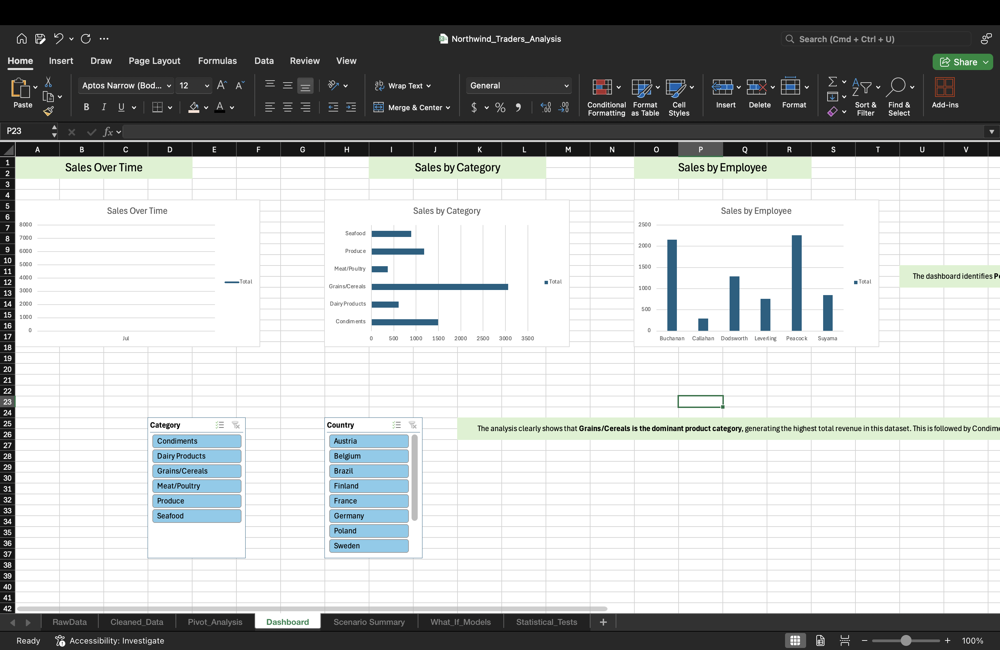
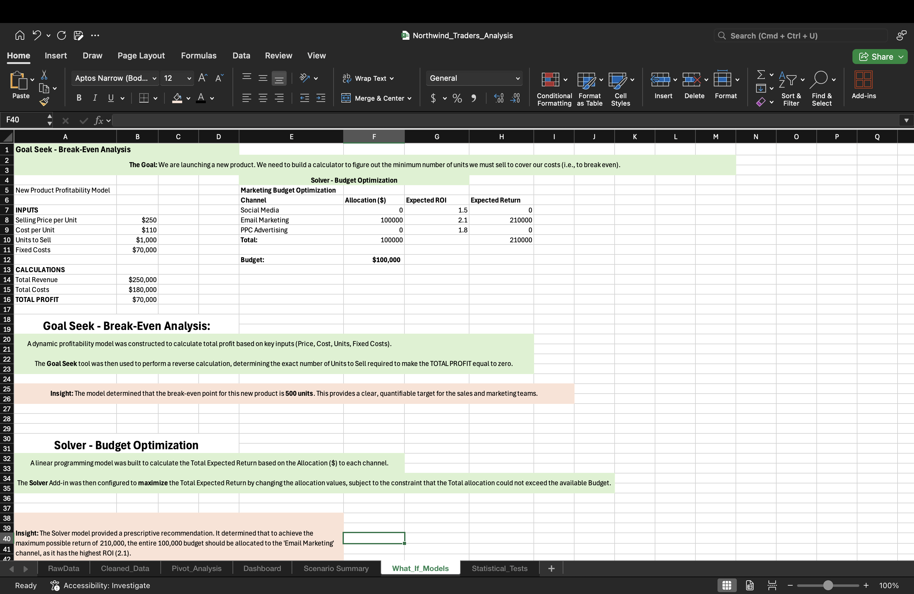
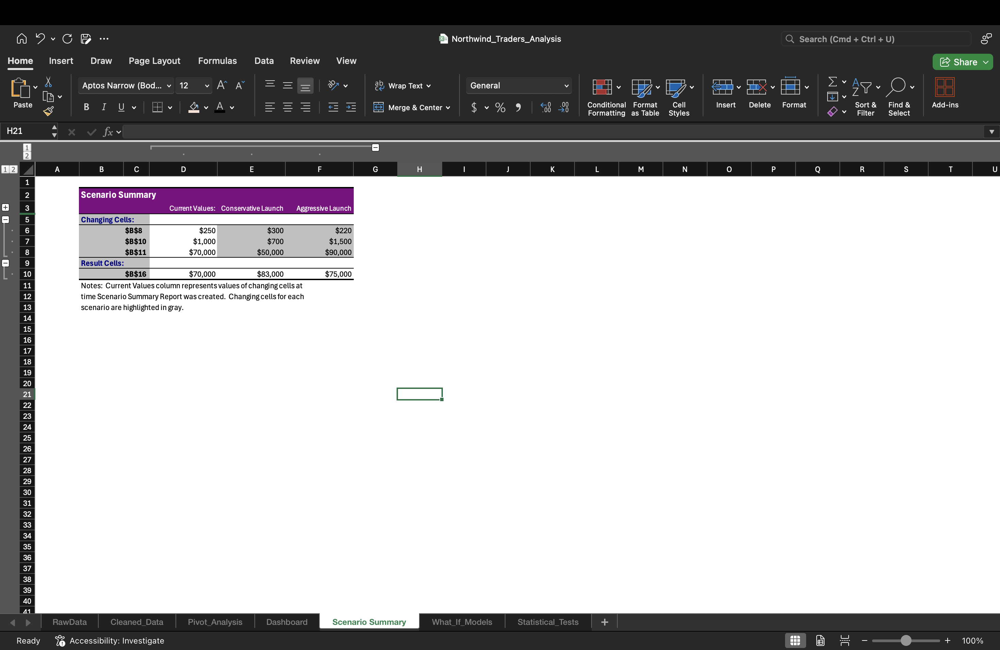
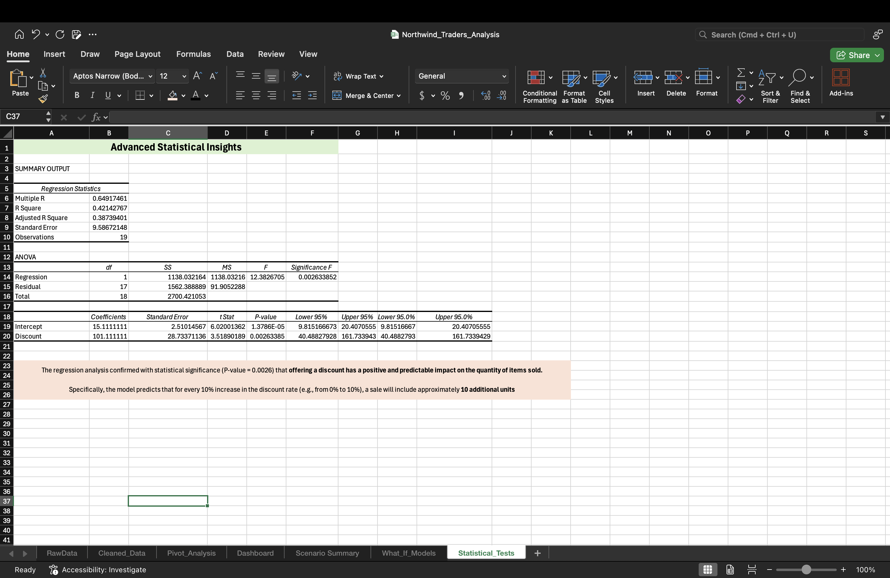

# Capstone Project: Northwind Traders Annual Performance Review & Strategic Outlook

**Project Status:** Completed

## Project Objective

This capstone project simulates a real-world business intelligence task. As a data analyst for Northwind Traders, I was tasked with taking a raw, uncleaned dataset of annual sales and transforming it into a comprehensive, end-to-end analysis.

The goal was to move beyond simple reporting to deliver actionable insights. This involved a complete analytical workflow: **(1)** cleaning and preparing the data, **(2)** building an interactive performance dashboard, **(3)** creating strategic models for future business decisions, and **(4)** using advanced statistical tools to validate key business hypotheses.

---

## Skills and Tools Demonstrated

This project is a comprehensive portfolio demonstrating a full range of data analysis skills in Excel, from basic data wrangling to advanced predictive and prescriptive modeling:

*   **Data Cleaning:** (Filter, Sort, Formulas)
*   **Data Structuring:** (Excel Tables, Structured Referencing)
*   **Data Summarization:** (PivotTables, Grouping)
*   **Data Visualization:** (PivotCharts, Custom Charts)
*   **Dashboarding:** (Slicers, Report Connections, Conditional Formatting)
*   **What-If Analysis:** (Goal Seek, Scenario Manager)
*   **Optimization Modeling:** (Solver Add-in)
*   **Statistical Analysis:** (Analysis ToolPak: Descriptive Statistics, Regression)

---

## Part 1: Data Cleaning and Preparation

The initial phase involved taking the raw data export and preparing it for analysis. This included:
*   Using **Filters** to identify and remediate missing data points in the `Discount` column.
*   Creating new calculated columns for `TotalRevenue` and `CostOfGoods` to enrich the dataset.
*   Converting the entire cleaned range into a named **Excel Table** (`tblSalesData`) to ensure a robust and dynamic data source for all subsequent analysis.

## Part 2: Interactive Performance Dashboard

An interactive dashboard was built to provide management with a high-level overview of sales performance. The dashboard is powered by a backend of multiple **PivotTables** and is controlled by **Slicers**, allowing for dynamic filtering by `Country` and `Category`.

**Key Visuals:**
*   A **Line Chart** to track monthly revenue trends.
*   A **Bar Chart** to compare revenue across different product categories.
*   A **Column Chart** with **Data Bars** to visually rank the performance of each employee.

## Part 3: Strategic Modeling and Optimization

This phase focused on using the data to inform future business decisions.

*   **Break-Even Analysis (Goal Seek):** A profit model was built for a new product, and **Goal Seek** was used to determine that **500 units** must be sold to cover all costs.
*   **Strategy Comparison (Scenario Manager):** Multiple launch strategies (`Aggressive`, `Conservative`, `Balanced`) were modeled. The **Scenario Manager** generated a summary report to clearly compare the potential profitability and risks of each approach.
*   **Budget Optimization (Solver):** A model was built to allocate a marketing budget across three channels with different ROIs. **Solver** was used to find the optimal allocation, proving that investing the entire budget in the single highest-ROI channel (Email Marketing) would maximize the total expected return at **$210,000**.

## Part 4: Advanced Statistical Insights

The final phase used the **Analysis ToolPak** to answer a key strategic question: "Do discounts significantly impact the quantity of items sold?"

*   **Tool Used:** Linear Regression Analysis.
*   **Result:** The regression model was found to be statistically significant (Significance F < 0.05).
*   **Key Finding:** The **P-value** for the `Discount` coefficient was **0.0026**, confirming a significant positive relationship. The model's **R-Square** value of 0.42 indicates that **42% of the variation in sales quantity can be explained by the discount offered.**

---

## Final Recommendations to Management

Based on the complete analysis, the following strategic recommendations were made:
1.  **Focus on Core Markets:** Brazil and France are the top-performing countries and should be the focus of continued marketing efforts.
2.  **Leverage Discounting:** Since discounts are statistically proven to increase sales volume, a structured, data-driven discount strategy should be implemented, especially in key markets or for high-performing product categories.
3.  **Invest with Data:** The Solver model demonstrates that marketing budgets should be allocated based on ROI data, not distributed evenly. Future budget decisions should be modeled to maximize returns.

This project successfully transformed raw data into a strategic asset, providing clear, data-driven insights to guide future business decisions.
